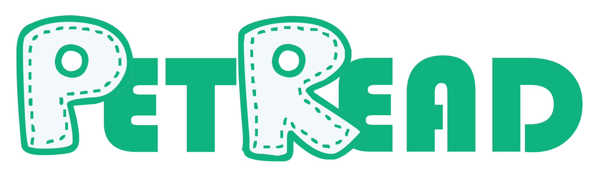

# PetCare Assistant

 <!-- Replace with your actual logo -->

An intelligent web application designed to empower pet owners by identifying their pet's breed from an image and providing personalized, comprehensive care recommendations powered by cutting-edge AI and knowledge base integration.

## Overview

The PetCare Assistant is a full-stack application built to simplify pet care. By uploading a photo of a dog or cat, users can instantly identify the breed using advanced machine learning models. The system then leverages generative AI and information from trusted sources like Wikipedia to curate detailed, breed-specific guidance on essential aspects of pet welfare, including nutrition, health, grooming, and physical activity. The goal is to offer accessible, tailored advice that helps owners provide the best possible care for their companions.

## Features

*   **Dual-Model Breed Identification:** Utilizes two distinct Keras/TensorFlow models (a custom VGG-like model and EfficientNetB3) for enhanced accuracy and robustness in identifying over 30+ dog and cat breeds.
*   **Confidence Scoring:** Provides a percentage indicating the model's certainty for the predicted breed.
*   **Wikipedia Integration:** Fetches a concise summary from Wikipedia for the identified breed, offering foundational information and context.
*   **AI-Powered Care Recommendations:** Integrates with the Groq API to dynamically generate structured care guidelines covering:
    *   Recommended Food Types and Frequency
    *   Key Health Checkups and Vaccinations
    *   Grooming Needs (Bathing, Brushing)
    *   Activity and Exercise Suggestions
    *   Breed-Specific Health Warnings/Considerations
    *   Additional Special Tips
*   **Structured and Validated Output:** Care recommendations are generated and validated against a Pydantic model, ensuring a consistent and reliable JSON structure.
*   **Interactive Web Interface:** A modern, single-page frontend with a clean UI supporting drag-and-drop or click-to-upload functionality and presenting results in an intuitive chat-like format.
*   **Downloadable PDF Report:** Generate and download a comprehensive PDF report containing the pet identification details, breed information, and AI-generated care recommendations directly from the browser.
*   **Robust Backend:** A lightweight yet powerful Flask backend handling image processing, model inference, API calls, and data formatting.
*   **Secure Configuration:** Manages sensitive API keys using environment variables loaded via `python-dotenv`.

## Technologies Used

**Backend:**

*   Python 3.x
*   [Flask](https://flask.palletsprojects.com/)
*   [TensorFlow](https://www.tensorflow.org/) / [Keras](https://keras.io/)
*   [Pillow (PIL Fork)](https://python-pillow.org/)
*   [NumPy](https://numpy.org/)
*   [python-dotenv](https://pypi.org/project/python-dotenv/)
*   [wikipedia (Python)](https://pypi.org/project/wikipedia/)
*   [groq-sdk](https://pypi.org/project/groq-sdk/)
*   [Pydantic](https://docs.pydantic.dev/)

**Frontend:**

*   HTML5
*   CSS3 (Inline styles)
*   JavaScript
*   [Font Awesome](https://fontawesome.com/) (via CDN)
*   [jsPDF](https://jspdf.org/) (via CDN)
*   [html2canvas](https://html2canvas.hertzen.com/) (via CDN)

**Machine Learning:**

*   Keras Models (.keras format)
*   Pickle Files (.pkl format)

## Getting Started

Follow these steps to set up and run the PetCare Assistant on your local machine.

### Prerequisites

*   Python 3.7+
*   `pip` (Python package installer)
*   Stable internet connection
*   A [Groq API Key](https://console.groq.com/)

### Installation

1.  **Clone the repository:**

    ```bash
    git clone <repository_url>
    cd petcare-assistant
    ```

2.  **Create a virtual environment (highly recommended):**

    ```bash
    python -m venv venv
    ```

3.  **Activate the virtual environment:**

    *   On macOS and Linux:
        ```bash
        source venv/bin/activate
        ```
    *   On Windows:
        ```bash
        venv\Scripts\activate
        ```

4.  **Install the required Python packages:**

    Create a file named `requirements.txt` in the project root directory and add the following dependencies:

    ```txt
    Flask
    tensorflow # Use tensorflow-cpu if you don't have a compatible GPU
    Pillow
    numpy
    python-dotenv
    wikipedia
    groq-sdk
    pydantic
    ```

    Then install them:

    ```bash
    pip install -r requirements.txt
    ```

5.  **Obtain ML Models and Mapping Files:**

    The trained models (`.keras`) and their corresponding breed index mapping files (`.pkl`) are typically large and not included in the repository. You will need to obtain these files separately and place them in the correct directories:

    *   Create a directory named `model` in the project root.
    *   Place `final_pet_classifier_model_v3.keras` and `final_EfficientNetB3_model.keras` inside the `model/` directory.
    *   Create a directory named `mapping` in the project root.
    *   Place `index_to_breed_map.pkl` and `index_to_breed_mapefficient.pkl` inside the `mapping/` directory.

    **(Note: You are responsible for acquiring these trained model files.)**

6.  **Create `mapping_animal.py`:**

    Create a file named `mapping_animal.py` in the project root directory and paste the provided Python code for breed-to-animal mapping.

7.  **Set up Frontend Files:**

    *   Create a directory named `src` in the project root.
    *   Inside `src`, create a file named `index.html` and paste the provided HTML content.
    *   (Optional) If you want the logo to appear, create an `img` directory inside `src` (`src/img/`) and place your logo file named `LOGO.png` there.

### Configuration

1.  **Set up Groq API Key:**

    Create a file named `.env` in the **root directory** of your project (the same directory as `app.py`). Add your Groq API key in the following format:

    ```dotenv
    GROQ_API_KEY=your_groq_api_key_here
    ```

    Replace `your_groq_api_key_here` with the actual API key you obtained from the [Groq console](https://console.groq.com/).

## How to Run

1.  Ensure your virtual environment is active.
2.  Verify that your `.env` file contains your Groq API key.
3.  Confirm that the `model/`, `mapping/`, and `src/` directories contain the necessary files.
4.  Run the Flask application from the project root directory:

    ```bash
    python app.py
    ```

    The application will start and listen on the port specified by the `PORT` environment variable, defaulting to `80` if not set.

5.  Open your web browser and navigate to the application address, typically `http://127.0.0.1:80/` or `http://localhost/`.

## How to Use

1.  Load the application page in your browser.
2.  Use the "Browse Files" button or drag and drop an image file (JPG, PNG, GIF, BMP, WEBP) of a dog or cat onto the designated area. Ensure the file size is within the 5MB limit.
3.  Once the image preview is visible, the "Identify Pet" button will become active. Click it.
4.  The application will process the image and display the results in the chat interface:
    *   Predicted breed and confidence level.
    *   General information about the breed (from Wikipedia).
    *   Detailed care recommendations generated by the AI.
5.  Click the "Unduh PDF" button within the recommendations section to save the report.
6.  Click the "Reset" button to clear the current session and prepare for a new image upload.

## Project Structure

```
petcare-assistant/
├── .env                  # Environment variables (Groq API Key)
├── app.py                # Main Flask application logic
├── mapping_animal.py     # Helper for breed-to-animal type mapping
├── requirements.txt      # Python dependencies list
├── model/                # Directory for trained Keras models (.keras files)
│   ├── final_pet_classifier_model_v3.keras
│   └── final_EfficientNetB3_model.keras
├── mapping/              # Directory for breed index mapping files (.pkl files)
│   ├── index_to_breed_map.pkl
│   └── index_to_breed_mapefficient.pkl
└── src/                  # Frontend source files
    ├── index.html        # The main web interface HTML
    └── img/              # (Optional) Directory for static images
        └── LOGO.png      # Project logo
```

## Potential Improvements & Contribution

This project provides a strong foundation for a useful pet care tool. Potential areas for improvement and contribution include:

*   **Expanding Breed Coverage:** Train models on larger datasets to recognize a wider variety of breeds and potentially other animal types.
*   **Refining AI Prompts:** Optimize prompts for the Groq API to generate even more detailed, accurate, and nuanced care recommendations.
*   **Advanced Image Preprocessing:** Implement more sophisticated image validation or enhancement steps.
*   **User Authentication & Profiles:** Add features for users to save pet profiles and past identification/recommendation reports.
*   **Database Integration:** Store pet information, past analyses, or user data persistently.
*   **Dedicated API:** Create a separate API endpoint for programmatic access to the identification service.
*   **Frontend Enhancements:** Improve UI/UX, add responsiveness for different screen sizes, or migrate to a modern JavaScript framework (React, Vue, Angular).
*   **Internationalization:** Add support for multiple languages.
*   **Comprehensive Testing:** Implement unit and integration tests for both backend and frontend components.

We welcome contributions! If you have ideas or find issues, please feel free to open an issue or submit a pull request.

## Acknowledgments

*   The developers and communities behind Flask, TensorFlow, Groq, Wikipedia, jsPDF, and html2canvas.
*   The creators of the datasets used for training the underlying ML models.

---
